# Public Services Specialist Pack - Mod
This mod adds Specialists with focus on variuos Public Services / Wonders into Anno 117. This Mod is part as a submod of "Extended Specialists Mod".
***

### Specialists Overview (AI Generated - might still contain Issues)
***
### Common Specialists
| Image Preview | GUID | Internal Name | Itemname | Description | Targets | Base Effects |
| :---: | :---: | :---: | :---: | :---: | :---: | :---: |
|  | 1600000005 | Specialist AE-Bard-Belief-C | Unwanted Bard | "Here's to a little serenade"... "NOoooo! By Cernunnos stop him!" | Bardic Hearth | Area Effect:  • +0.5 Belief |
|  | 1600000013 | Specialist AE-Market-Belief-C | Religious Merchant | Offers a variety of different religious items for any deity. | Marketplace | Area Effect:  • +0.5 Belief |
|  | 1600000021 | Specialist AE-TabernaBard-Money-C | Tavern Guard | Makes sure every denarii is payed. | Tavern, Bardic Hearth | Area Effect:  • +0.5 Money |
***
### Rare Specialists
| Image Preview | GUID | Internal Name | Itemname | Description | Targets | Base Effects |
| :---: | :---: | :---: | :---: | :---: | :---: | :---: |
| 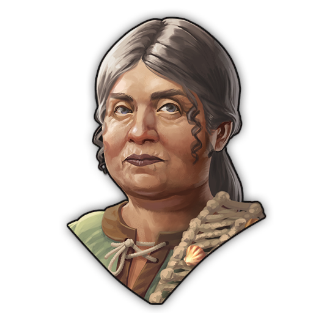 | 1600000166 | Specialist AE-CSGrove-Belief-NPresti-R | Pagan Ritualist | Executes celtic pagan rituals to the Romans' detriment. | Sacred Grove | Area Effect: • -1 Prestige • +1.5 Belief • +0.5 Knowledge |
| 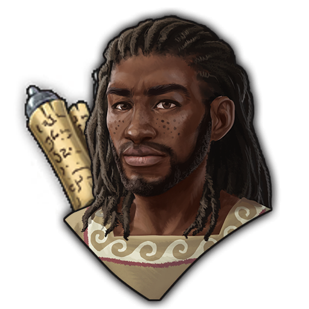 | 1600000178 | Specialist AE-Gramma-Know-R | Motivated Teacher | Investing into the future results in investing into Knowledge. | Grammaticus | Area Effect: • +1 Knowledge |
| 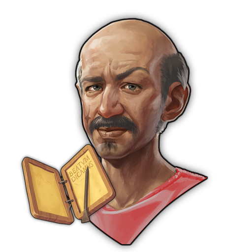 | 1600000174 | Specialist AE-Gamble-Money-NHappyBelief-R | Gambling Debt Collector | Allows high-risk bets just as an excuse to visit your home. Or better said his new home. | Gambling House | Area Effect: • -1 Happiness • +2 Money • -0.5 Belief |
|  | 1600000017 | Specialist AE-Sanc-Fanum-Belief-NMoney-R | Impoverished Priestess | Demonstrates to believers how to thrive without material resources. | Sanctuary, Fanum | Area Effect: • +0.5 Happiness • -1 Money • +1 Belief |
|  | 1600000162 | Specialist AE-Bath-Health-NHappy-R | Angry Bath Attendent | "By Neptune, don't jump off the edge into the bath!" | Baths | Area Effect: • -0.5 Happiness • +1.5 Health |
| 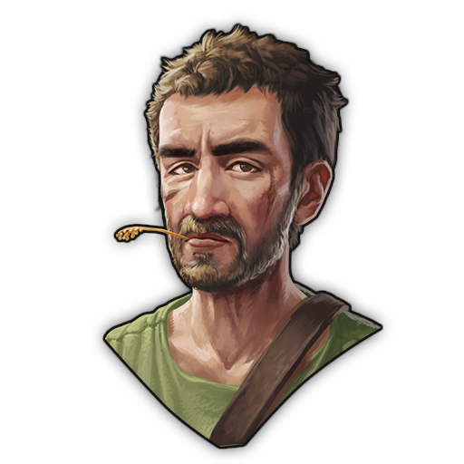 | 1600000009 | Specialist AE-CBarrow-HealthPresti-R | Celtic Grave Keeper | Preserves the ancient burial mounds. | Barrow | Area Effect: • +1 Prestige • +1 Health |
| 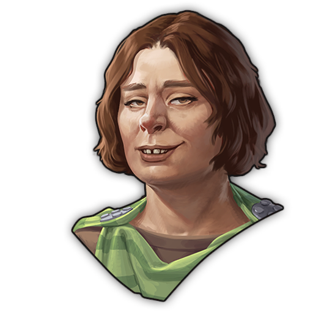 | 1600000186 | Specialist AE-Theater-Happy-NPresti-R | Mischievous Actor | Brings nearly everyone to a good laught, except the nobility. | Theaters | Area Effect: • +1 Happiness • -0.5 Prestige |

### Epic Specialists
| Image Preview | GUID | Internal Name | Itemname | Description | Targets | Base Effects |
| :---: | :---: | :---: | :---: | :---: | :---: | :---: |
|  | 1600000076 | Specialist AE-TempleCernunnos-E | Elder Druid of Cernunnos | Knows the old celtic virtues of the deity Cernunnos. | Temple | Area Effect:  • +0.8 Belief • +0.8 Health |
|  | 1600000080 | Specialist AE-TempleEpona-E | Elder Druid of Epona | Knows the old celtic virtues of the deity Epona. | Temple | Area Effect: • +0.8 Population • +0.8 Happiness |
|  | 1600000068 | Specialist AE-TempleMars-E | Priestess of Mars | Highly devoted and preaches the roman virtues of the deity Mars. | Temple | Area Effect: • +0.8 Population • +0.8 Prestige |
| 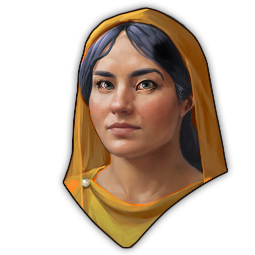 | 1600000084 | Specialist AE-TempleMercury-E | Priestess of Mercury | Highly devoted and preaches the roman virtues of the deity Mercury. | Temple | Area Effect: • +1.6 Money |
|  | 1600000088 | Specialist AE-TempleMinerva-E | Priestess of Minerva | Highly devoted and preaches the roman virtues of the deity Minerva. | Temple | Area Effect: • +0.8 Prestige • +0.8 Knowledge |
|  | 1600000092 | Specialist AE-TempleNeptune-E | Priestess of Neptune | Highly devoted and preaches the roman virtues of the deity Neptune. | Temple | Area Effect: • +0.8 Money • +0.8 FireSafety |
|  | 1600000072 | Specialist AE-TempleCeres-E | Priestess of Ceres | Highly devoted and preaches the roman virtues of the deity Ceres. | Temple | Area Effect: • +0.8 Population • +0.8 Health |
| 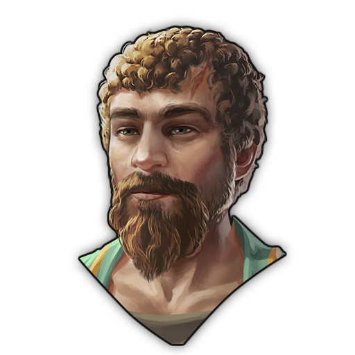 | 1600000048 | Specialist AE-CTHall-PrestiKnowHappy-E | Vidumaros, Celtic Traditionalist | Keeps celtic tradition alive through tellings of former generations. | Alder Council | Area Effect: • +1 Happiness • +1 Prestige • +0.5 Knowledge |
| 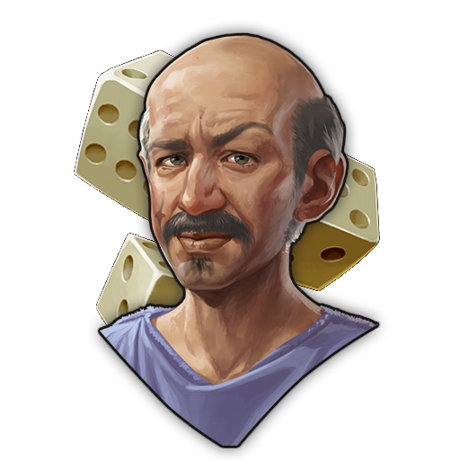 | 1600000056 | Specialist AE-Gamble-PrestiHappy-E | Probus, Honest Gambler | Checks every dice with a keen eye, so only fate decides your chances. | Gambling House | Area Effect: • +1 Happiness • +0.5 Prestige |
|  | 1600000060 | Specialist AE-Lib-KnowPresti-NFire-E | Julia Archivola, the Living Bibliothēcaria | Expands the library up to the ceiling with knowledge from distant lands. Let's hope there's no fire nearby. | Library | Area Effect: • +1 Prestige • +2 Knowledge • -1 Fire Safety |
| 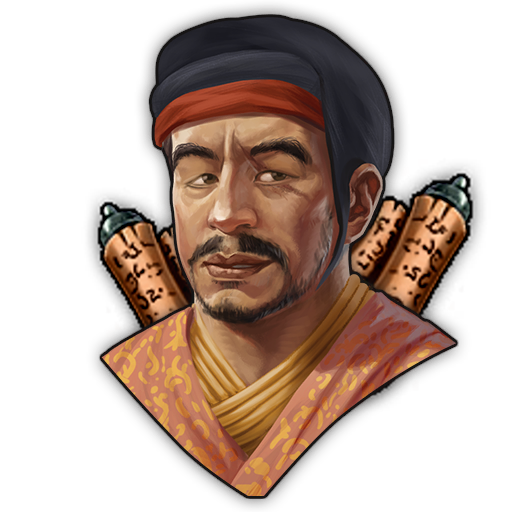 | 1600000064 | Specialist AE-Lib-PopHealthHappy-E | Varius Flexus, Human Biologist | Traveled to many coasts to observe and study all different types of human bodies. One of the first writers of scrolls on the flexibilty of human anatomy. | Library | Area Effect: • +0.5 Population • +0.25 Happiness • +1 Health |
|  | 1600000096 | Specialist AE-Theater-HealthHag-E | Ethelia, Hag Actress | Plays the role of a ugly hag, who loves to collect in other peoples eyeballs. Always open for a deal. In her favor of course. | Theaters | Area Effect: • +0.25 Happiness • +1.5 Belief • +0.25 Health |
| 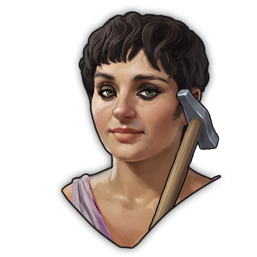 | 1600000220 | Specialist AE-Forum-CTHall-Popu-NAll-E | Aurelia Ordinata, Census Delegate | "117 Citzens... 1404 Citzens... 1503 Citzens... 1602 Citzens... 1800 Citzens... 2070 Citzens... 2205 Citzens..." | Forums and Alder Council | Area Effect: • +2 Population • -1 Happiness • -1 Fire Safety |
| 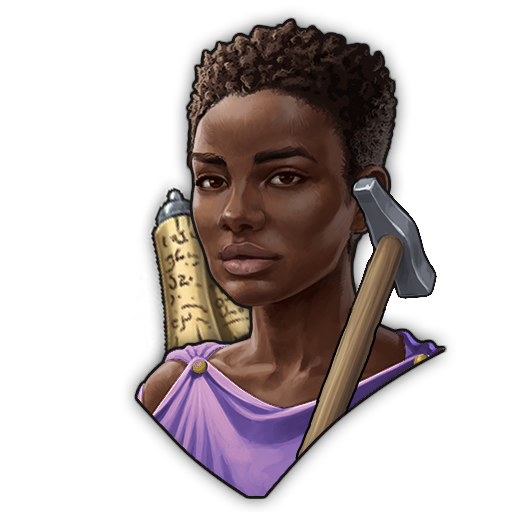 | 1600000230 | Specialist AE-Gramma-AddGoods-NBelief-E | Fabia Novella, Experimental Crafter | Teaches experimental craftmanship which causes citizens to stop trusting the gods. | Grammaticus | Area Effect: • -1 Belief   • All ProductionBuildings: Additional Product every 5 Cycle |
